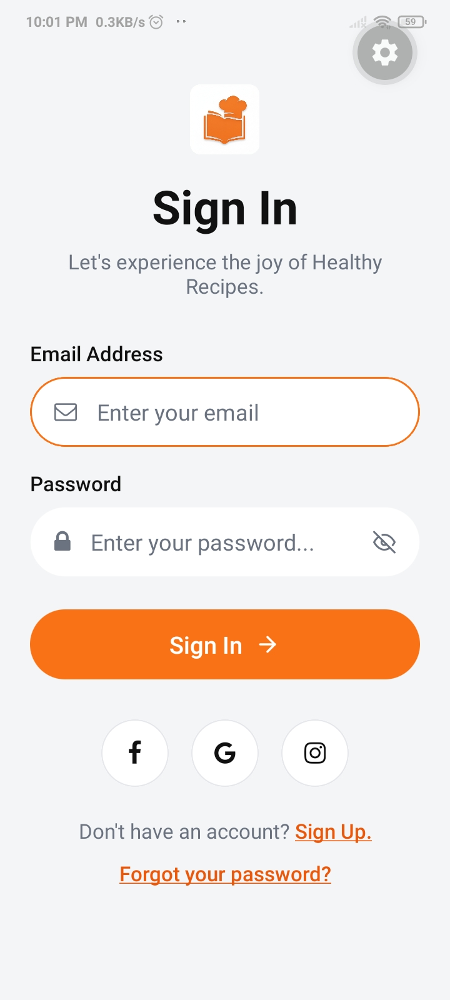

# Login Screen — Mobile Dev Assignment

A React Native (Expo) implementation of a multi-screen authentication flow built from design references. The goal of this assignment was to practice layout, component structuring, and UI implementation by translating designs into pixel-accurate screens.

## Project Description

This project is a React Native (Expo) implementation of a three-screen authentication flow — **Sign In**, **Sign Up**, and **Forgot Password** — built from provided design references as part of a mobile development assignment.

The focus of the assignment was practicing **layout composition**, **component structuring**, and **design-to-code translation**, so the app intentionally uses only React Native's built-in components and `StyleSheet` rather than a UI library.

### Highlights

- **File-based routing** with `expo-router` (`/`, `/signup`, `/forgotpassword`).
- **Reusable design tokens** in `src/colors.ts` — switching the entire app from a lime-green reference to an orange theme required changing only two values.
- **Pixel-accurate UI** matching the reference designs: pill-shaped inputs with leading/trailing icons, focused-state borders, selectable cards, social-auth buttons, and a primary action button with arrow icon.
- **Form interactions** on Sign Up: controlled inputs, password show/hide toggle, and client-side validation (empty fields + password match) before navigating to the dashboard.
- **Selectable card pattern** on Forgot Password: tap to switch between Email, 2FA, and Google Authenticator reset methods, with selected-state border + tinted icon background.

### Project Structure

```
src/
├── app/
│   ├── _layout.tsx          # Root Stack navigator
│   ├── index.tsx            # Sign In screen
│   ├── signup.tsx           # Sign Up screen
│   ├── forgotpassword.tsx   # Forgot Password screen
│   └── dashboard.tsx        # Post-login destination
└── colors.ts                # Shared theme tokens
```

## Tech Stack

- **Expo** (SDK 55) + **expo-router** for file-based navigation
- **React Native** in-built components with `StyleSheet`
- **@expo/vector-icons** (FontAwesome + Feather)
- **TypeScript**

## Screens

|                  Sign In                   |                  Sign Up                   |                  Forgot Password                   |
| :----------------------------------------: | :----------------------------------------: | :------------------------------------------------: |
|  |  |  |

### Sign In (`src/app/index.tsx`)

Email + password form with leading icons, focused-state border, social sign-in row (Facebook / Google / Instagram), and links to Sign Up and Forgot Password.

### Sign Up (`src/app/signup.tsx`)

Email, Password, and Password Confirmation fields with show/hide toggle, controlled form state, and basic client-side validation (empty fields + password match) before navigating to the dashboard.

### Forgot Password (`src/app/forgotpassword.tsx`)

Three selectable reset methods (Email, 2FA, Google Authenticator) rendered as cards with selected-state highlighting, a back button, and a primary "Reset Password" action.

## Theming

A small color token module (`src/colors.ts`) drives the entire app. The screens were originally built against a lime-green reference and re-themed to orange by changing only two tokens:

```ts
primary: "#F97316",
primaryDark: "#EA580C",
```

## Getting Started

```bash
npm install
npm run start     # Expo dev server
npm run android   # Run on Android
npm run ios       # Run on iOS
npm run web       # Run on web
```
